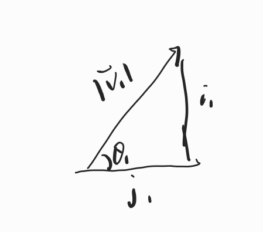
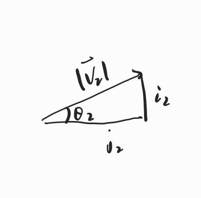
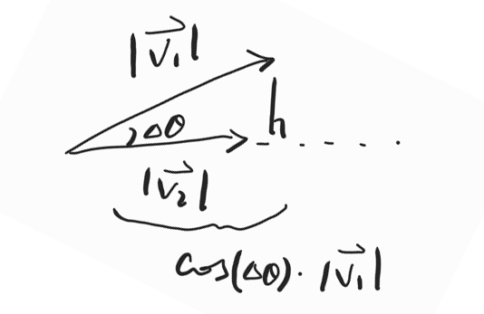
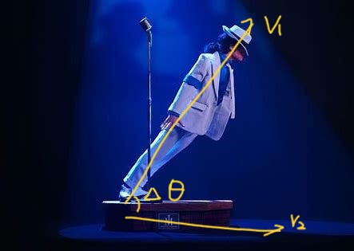

Since graduating from my undergrad, much of my knowledge has faded. Recently, I'm reviewing some core concepts. Here I show an example of dot products for 2 vectors with length 2 to help understand the idea of dot product (not a proof).

Given $\mathbf{v_1} = \begin{bmatrix} i_1 \\ j_1 \end{bmatrix}, \mathbf{v_2} = \begin{bmatrix} i_2 \\ j_2 \end{bmatrix}$   
Shown below:

|               V1                |               V2                |
| :-----------------------------: | :-----------------------------: |
|  |  |

So that dot product is 

$$\mathbf{v_1} \cdot \mathbf{v_2} = i_1\cdot i_2 + j_1\cdot j_2$$
$$= |\mathbf{v_1}|\sin\theta_1\cdot|\mathbf{v_2}|\sin \theta_2 + |\mathbf{v_1}|\cos\theta_1\cdot|\mathbf{v_2}|\cos \theta_2$$
$$= |\mathbf{v_1}||\mathbf{v_2}|(\sin\theta_1\cdot\sin\theta_2+\cos\theta_1\cdot\cos\theta_2)$$
Then by cosine identity, which is $\cos(\theta_1-\theta_2) = \cos\theta_1\cdot\cos\theta_2+\sin\theta_1\cdot\sin\theta_2$, we get
$$\mathbf{v_1} \cdot \mathbf{v_2} = |\mathbf{v_1}||\mathbf{v_2}|\cos(\theta_1-\theta_2)$$
$$= |\mathbf{v_1}||\mathbf{v_2}|\cos(\Delta\theta)$$
$$= |\mathbf{v_1}|\cos(\Delta\theta)\cdot|\mathbf{v_2}|$$
When put two vectors together, we see the intuitive meaning of it, which is multiplication of the length of projection of $\mathbf{v_1}$ on $\mathbf{v_2}$ with the length of $\mathbf{v_2}$. 

Which is a scale related to the angle between two vectors (more specifically, in what degree they are in the same line) and the length between them. So when people only care about the level of parallel, they do cosine similarity:

$$\text{cosine similarity} = \frac{\mathbf{v_1}\cdot\mathbf{v_2}}{|\mathbf{v_1}||\mathbf{v_2}|} = \cos(\Delta\theta)$$
Hope this example helps you build more **intuition** about the operation, it does for me a little bit. If not, let's go through an real life example:

Imagine MJ performing his famous Anti-Gravity Lean over a line drawn on the ground. Let MJ be $\mathbf{v_1}$ and the line be $\mathbf{v_2}$ (we view from aside), there's sunshine above MJ head. We observe this performance from a location orthogonal to the plane formed by standing MJ and the line. $\cos\Delta\theta\cdot\mathbf{v_1}$ is the shadow of MJ on the line, the closer MJ is to being parallel with the line (the floor), the longer his shadow becomes, and therefore the larger the dot product of MJ and the line would be.
To MJ, the dot product might be something correlated to his sense of the length of the line (when the line is beneath him). Since the more parallel they are, the longer the line is in his eyes.

Note: this is not a formal proof, for formal proof you can see [here](https://tutorial.math.lamar.edu/classes/calcii/dotproduct.aspx)
