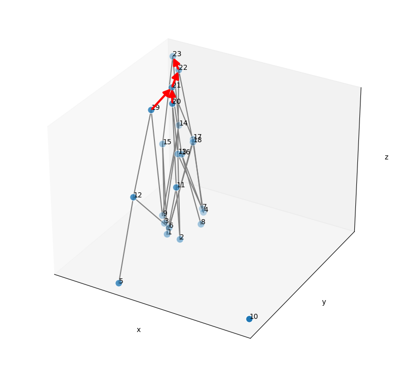

 naive example of the structure

Above is a naive example that shows the main component of the potential model: the connections between representations, and the connections between states (by actions). There will be a lot of features needed to be adjusted, just providing an insight into the model.

# Elements

The two main elements required to generate this structure are representations (set of representations), and actions (sequence of actions). The finest elements of them (without elements constructing them) are the representation units and action units. These elements are connected by two types of connection, let's call them connection 1 and connection 2. Connection 1 is intended to simulate semantic memory, priming, activation of knowledge, etc. Connection 2 is intended to simulate procedural memory, knowledge of problem-solving, etc. Connection 2 is always directed, but the features of Connection 1 will need more discussion.

## 1 Representation

Representation is an abstract but simple concept. It's a set of certain information (elements), and the elements within a representation can be representation units, representations, ordered pairs of representations, or actions. You can consider it as a node in an artificial neural network that explicitly states its meaning (which makes the model more explanatory).

### 1.1 Representation Unit

A representation unit is the most basic unit of representation, which contains nothing. You can consider it as a sensory unit, which provides information by itself. In the implementation, representation is more like a starting point of the model, the implementer of the model could determine its level of specificity. For instance, in discourse psychology, a representation unit can be a letter, a word, or a thought unit.

### 1.2 State

A state is a representation in connection 2. Consider the experience of feeling hungry and finishing your meal, these are two states. It is a set of representations that might provide you with an experience. I'm using "might" here because it's not guaranteed that any state would provide you with an experience, some of the states are generally retrieved unconsciously and thus cannot be experienced (if we define experience as something involving consciousness). 

### 1.3 Goal

A goal is a desired state. That is, it involves connection 2. To make it more specific, we define it as a sink (without outgoing edges) representation in connection 2. That is, consider the case you feel hungry, and it is connected to a state of fullness. In a bigger graph of connection 2, where the state of full is pointing to a state of survival, the state of full cannot be considered as a goal. However, when we extract the subgraph, in which the state of full is pointing to nothing, it can then be considered as a goal.

## 2 Action

An action is an activity that leads individuals to change their state. Creature won't be able to generate movement with only observations of states. Thus, action is essential. I identify two types of action, physical and mental. However, how to define action precisely still faces some issues and we will introduce the issues later. Currently, let's define an action as a list of actions.

### 2.1 Action Unit

An action unit is the minimal unit of action, which contains nothing but represents a single individual change (physical or mental).

### 2.1 Physical Action

Physical action is straightforward, any movement of muscle can be considered physical activity. Thus physical actions have a strong relationship with the motor system. Generally, we can use the easy definition of action for physical activity. Consider the action of drinking water, it can include multiple actions such as picking up a bottle and pouring the water into your mouth. However, if we consider the action unit as the firing of our motor neurons, there might be some parallel action. Thus it might be better to use the graph to represent actions.

### 2.2 Mental Action

Mental action indicates mental functions, such as solving a math problem or thinking about philosophical problems. Similar to physical activity, it can be considered as a list of actions in the simple case. However, in most cases, there might be function calling or parallel actions going on. Also, there might be an information passing issue for the function calling of parallel actions, that is, how does an action distribute its input to multiple subactions? Mental action can be much more complicated than physical action, thus it is worth more discussion about how to implement mental action in the future.
