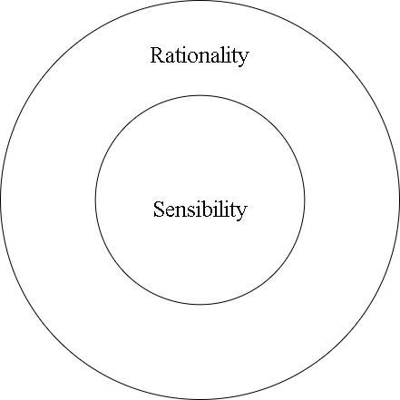

# What for
Perhaps it would be a dream for most psychologists to construct a model to simulate all behaviors and cognitive processes of human beings.
It would not be impossible to fully achieve this goal, but we can gradually approach it by setting a more basic goal: create a creature that demonstrates some core features of human beings and other organisms. Who doesn't want to be a god?

# What is a creature
Then we get a question: what is a creature?
Let's say, a creature is something that performs actions, based on certain needs. The ultimate need of a creature is to maintain its blueprint.
I don't want to discuss where this definition comes from now, but let's start with it.

# Potential model
Now we have the two core factors of the creature we want to construct: need and action. When I was in middle school, I called them "sensibility" and "rationality" and my understanding of the relation between them was:

 inside out

In high school, I replaced "sensibility" with "needs" and "rationality" with "methods" (now "actions"). The terminology is not important, you get the idea. With this basic idea, we can start our journey of creating.
Before that, I want to say, every model consists of certain static structures and dynamic processes. We will use directed graphs as our static structure.

# Now we can start

1. [[structure-elements]]
2. [[process-bases]]
